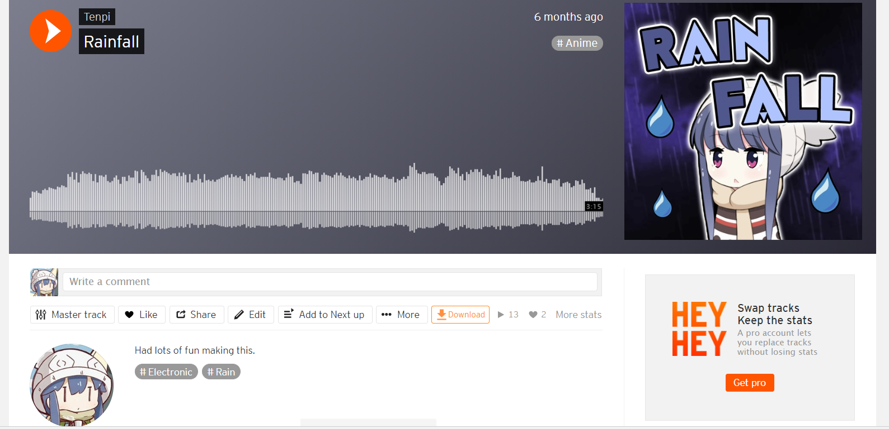

<h1>Soundcloud Extension</h1>
 
This is a simple extension that adds a download button to Soundcloud pages.
 
 

#### Features:
- Download individual tracks (track page)
- Download all of a user's tracks (user page)
- Download all tracks in a playlist (playlist page)
- Download tracks/playlists on the search page
- Download the song cover art images
- Adds metadata such as song title and cover art

Sometimes you may need to refresh the page in order for the button to show up.

#### Bugs/Feature Requests:
You can open an issue on my github repository here: https://github.com/Tenpi/soundcloud-download

#### Extension Pages:
Chrome: https://chrome.google.com/webstore/detail/soundcloud-download/alonjekfomgihkmbejlpnohliidafdep
Firefox: https://addons.mozilla.org/en-US/firefox/addon/sc-download/
